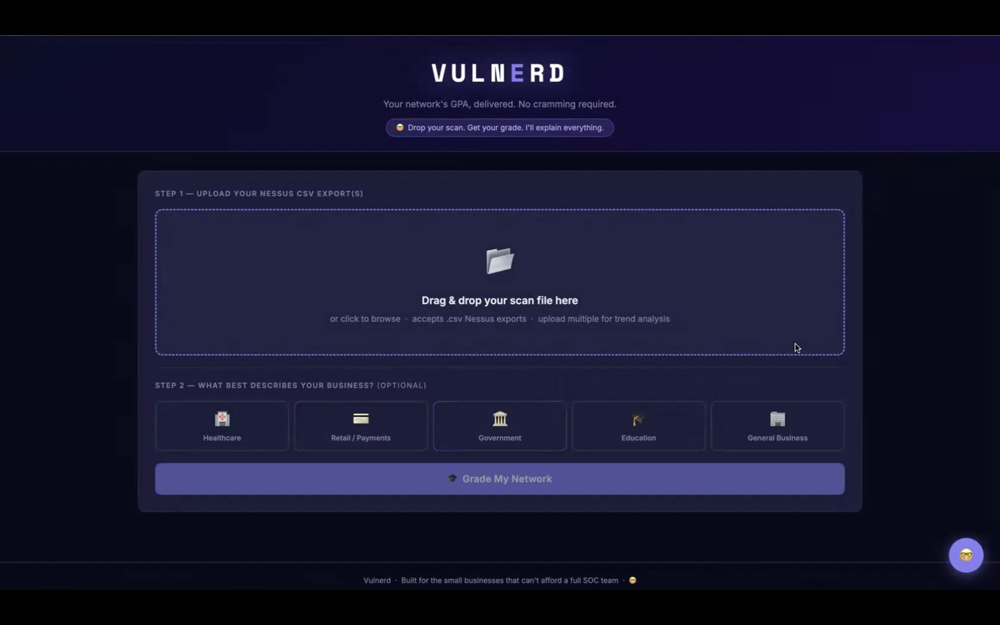
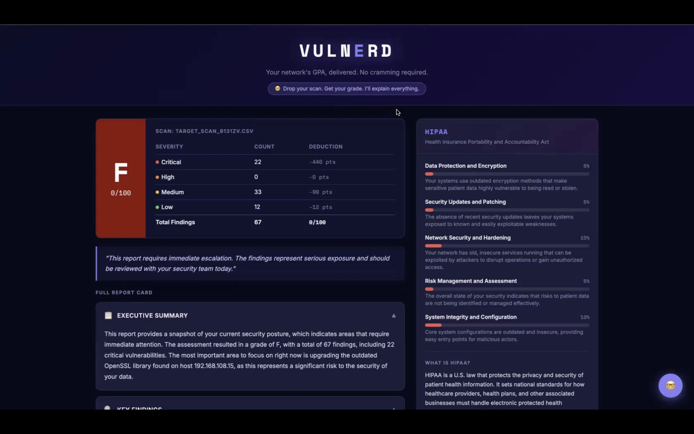
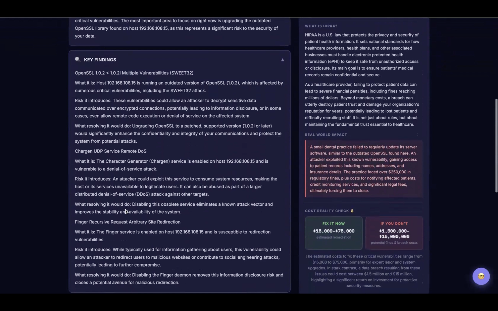
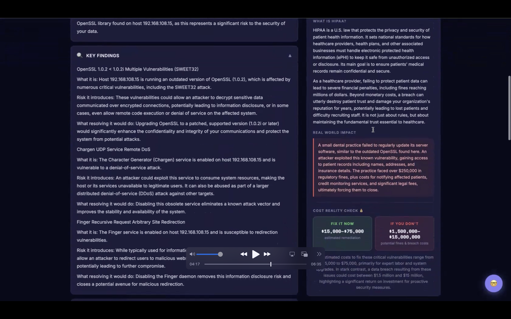
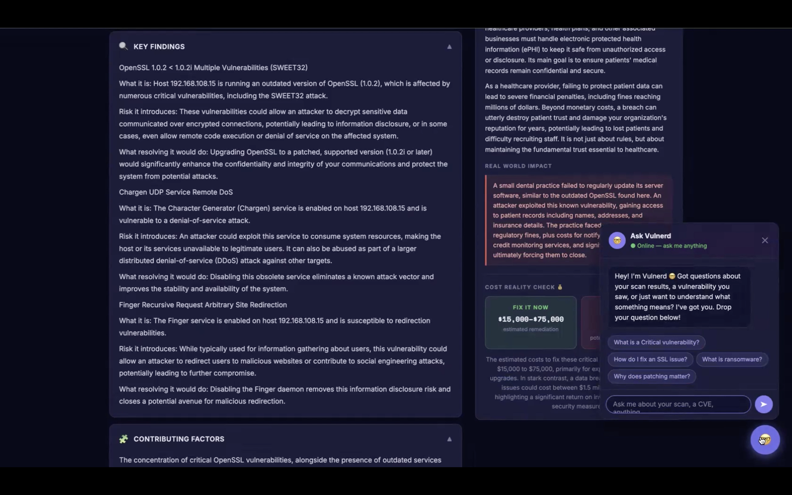

# VulNerd — Cybersecurity Report Card Engine

> Your network's GPA, delivered. No cramming required.

VulNerd is a web-based tool that takes a Nessus vulnerability scan, analyzes it with AI, and hands you back a plain English report card. A letter grade, key findings explained like a human wrote them, a compliance dashboard mapped to your industry, and real numbers on what fixing things costs versus what ignoring them costs. No security team required.

Built for small businesses that cannot afford a full SOC team, and for students learning to turn raw scan data into actionable security analysis.

---

## Screenshots


*Step 1 — Upload your Nessus CSV and select your business type*


*Your network graded like a report card, with a full compliance dashboard on the right*


*Every finding explained in plain English — what it is, what risk it introduces, and what fixing it would do*


*Industry-specific compliance scoring with a real world breach story and cost comparison*


*Ask VulNerd anything about your scan in real time*

---

## What It Does

- Reads your Nessus CSV and grades your network from A to F
- Explains every vulnerability in plain English — no jargon, no CVE soup
- Maps your scan to the right compliance framework based on your industry (HIPAA, PCI-DSS, NIST 800-53, FERPA, or CIS Controls)
- Shows you a side-by-side cost comparison between fixing issues now and dealing with a breach later
- Generates a professional PDF report card you can email to stakeholders
- Includes a built-in AI chat assistant with full context on your scan

---

## Tech Stack

| Layer | Technology |
|-------|-----------|
| Backend | Python 3 (stdlib HTTP server — no Flask) |
| AI Analysis | Google Gemini 2.5 Flash |
| PDF Generation | ReportLab |
| Frontend | Vanilla HTML, CSS, JavaScript |
| Email Delivery | SMTP via Gmail |
| Scanning | Nessus Essentials (CSV export) |
| Credentials | python-dotenv |

---

## How to Run It

### What you need
- Python 3.9 or higher
- A free Google Gemini API key from [aistudio.google.com](https://aistudio.google.com)
- A Gmail account (optional, for email delivery)

### Step 1 — Clone or download the repo
Click the green **Code** button and select **Download ZIP**. Unzip and place the folder somewhere easy to find.

### Step 2 — Open Terminal and navigate to the folder
```bash
cd path/to/Vulnerd
```
On Mac you can type `cd ` then drag the folder into Terminal to auto-fill the path.

### Step 3 — Create a virtual environment
```bash
python3 -m venv venv
source venv/bin/activate
```
You will see `(venv)` appear at the start of your terminal line when it is active.

### Step 4 — Install dependencies
```bash
pip install python-dotenv reportlab google-genai
```

### Step 5 — Create your env file
Create a file called `env` (no extension) inside the project folder:
```
GEMINI_API_KEY=your_key_here
EMAIL_SENDER=youremail@gmail.com
EMAIL_PASSWORD=your_app_password
SMTP_SERVER=smtp.gmail.com
SMTP_PORT=587
```
> For Gmail, `EMAIL_PASSWORD` must be an **App Password**, not your regular password. Generate one at Google Account → Security → 2-Step Verification → App Passwords.

### Step 6 — Start the server
```bash
python3 app.py
```

### Step 7 — Open your browser
Go to **http://localhost:5001**

---

## How It Works

VulNerd processes your scan through five stages:

1. **Parse** — A Python engine reads the Nessus CSV, cleans the data, and sorts findings by severity
2. **Score** — A deduction-based grading system calculates your score (Critical: -20, High: -8, Medium: -3, Low: -1) and maps it to a letter grade
3. **Analyze** — Google Gemini reads the findings and writes a full plain English report card with an executive summary, key findings, recommendations, and an instructor's note
4. **Comply** — A second AI pass maps your scan to your industry's compliance framework and builds a scored dashboard with breach costs and remediation estimates
5. **Deliver** — Results render in the browser. A PDF report card can be emailed directly from the interface

---

## Grading Scale

| Score | Grade |
|-------|-------|
| 93-100 | A |
| 90-92 | A- |
| 87-89 | B+ |
| 83-86 | B |
| 80-82 | B- |
| 77-79 | C+ |
| 73-76 | C |
| 70-72 | C- |
| 67-69 | D+ |
| 63-66 | D |
| 60-62 | D- |
| Below 60 | F |

---

## Compliance Frameworks

| Business Type | Framework |
|--------------|-----------|
| Healthcare | HIPAA |
| Retail / Payments | PCI-DSS |
| Government | NIST 800-53 |
| Education | FERPA |
| General Business | CIS Controls |

---

## Troubleshooting

**Port already in use**
```bash
lsof -ti :5001 | xargs kill -9
```
Then start the server again.

**App runs but no AI analysis**
Your Gemini API key in the `env` file is missing or incorrect. Double check it matches what is shown at aistudio.google.com.

**pip install fails**
Make sure `(venv)` is showing in your terminal before running pip. If not, run `source venv/bin/activate` first.

**Windows users**
Replace `source venv/bin/activate` with `venv\Scripts\activate`

---

## Project Structure

```
Vulnerd/
├── app.py                 # Backend server, AI pipeline, compliance engine
├── vulnerd.py             # Original CLI tool
├── templates/
│   └── index.html         # Entire frontend — one file
├── demo_scans/            # Sample Nessus CSVs for testing
│   ├── scan_A_grade.csv
│   ├── scan_C_grade.csv
│   └── scan_hidden_critical.csv
└── README.md
```

---

## Demo Scans

Three sample CSV files are included in `demo_scans/` so you can test VulNerd without running a real scan:

- **scan_A_grade.csv** — Clean network, minimal findings, grades as an A
- **scan_C_grade.csv** — Mixed findings including High severity vulnerabilities, grades as a C
- **scan_hidden_critical.csv** — Looks clean with only minor issues, but one critical Log4Shell vulnerability drags the grade down

---

## Built By

Anthony Whiteman · Reynaldo Rodriguez · Jonathan Nava-Arenas · Luisa Faria Novy E Silva · Rickoy Cunningham

Florida International University — School of Engineering & Computing

---

*VulNerd — Built for the small businesses that cannot afford a full SOC team.*
